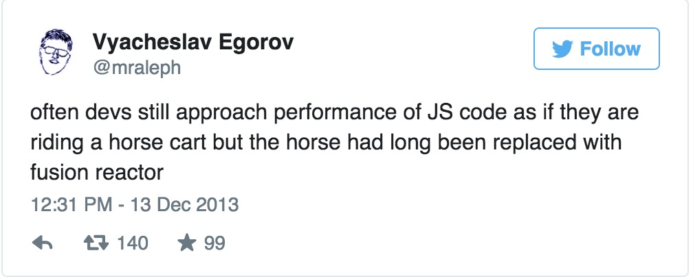
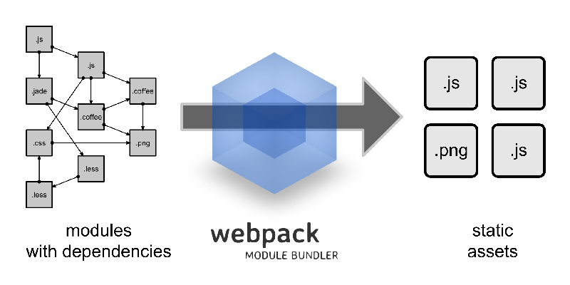
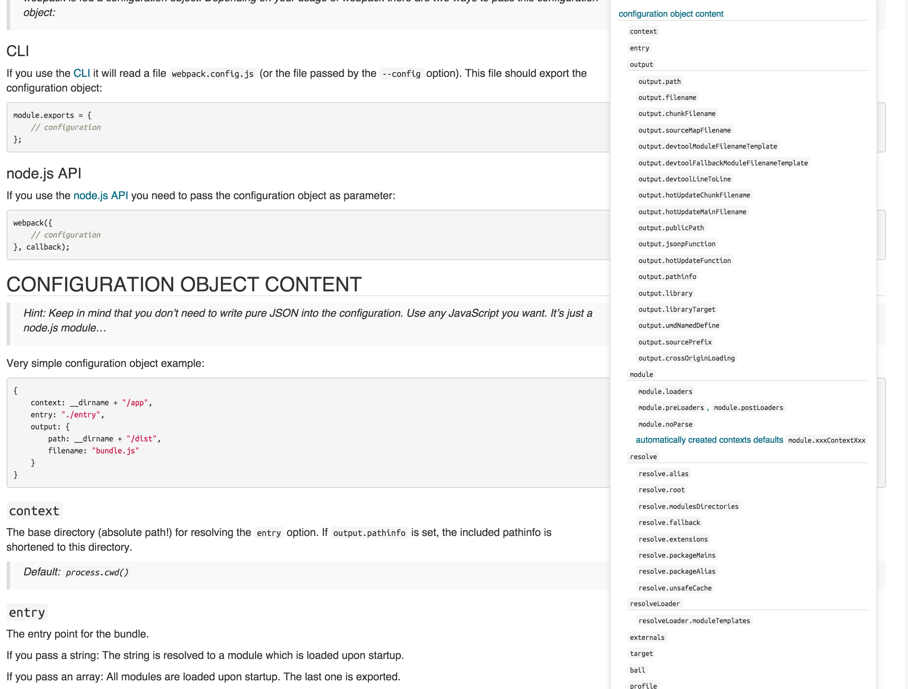
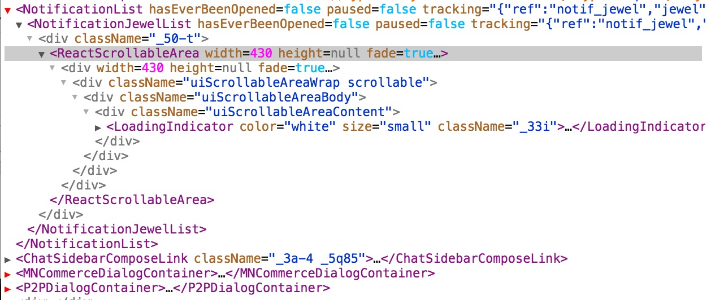
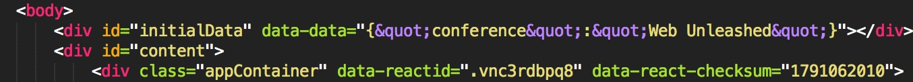
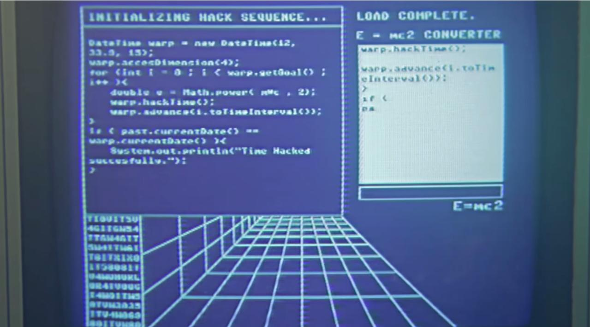
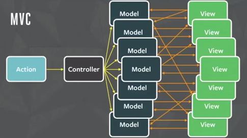

# Universal Web Applications with React & NodeJS

---

# Reducing Complexity
<hr />
## Building Scalable Web Applications

---

## Things that Sam likes

---

### Who's this clown?


<!-- As you can tell, I don't need any more contract work -->

* Samuel Reed - [STRML.net](http://strml.net)
* In Milwaukee, WI, previously Hong Kong & Washington DC
* Frontend developer for 10 years
* CTO and Co-Founder of [BitMEX](https://www.bitmex.com), the Bitcoin Mercantile Exchange
* Maintainer of ~10 React libraries

---

### Isomorphic / Universal JS

* NodeJS brought us JS on the server
* Browserify brought us shared libraries between client and server
  - Code transformers switch server libraries with browser libraries with identical APIs
* Webpack helps bring browser modules to the server
* React brings us an entire shared application

---

<!-- Let's talk a little more about why we want to do this in the first place. -->

### The Problem

Traditional webapps have complex state on a platform that was never designed for applications.

---

> ...Remember the days before React, when you had to write one piece of code to render your application and
> another to update it? HAHAHAHA. That was awful. React showed us that expressing our views declaratively
> leads to clearer, more predictable, and less error-prone applications.

[Andrew Clark, author of Flummox (Flux implementation)](https://github.com/acdlite/flummox/blob/v3.5.1/docs/docs/guides/why-flux-component-is-better-than-flux-mixin.md)

---

## Typical issues

<br />

* **Out-of-date data** <!-- It's easy to forget to change the data on a view in all places it is referenced. -->

* **Complex Local State** <!-- Views contain complex local state. Views can get into broken state. -->

* **Cascading Updates** <!-- Changing a model or collection causes another model or collection to change, cascading into complexity. -->

* **Difficult testing** <!-- Testing components requires rebuilding the app in a browser environment like PhantomJS. -->

---
### OH GOD WHY

 <!-- .element: class="large" -->

<!-- Problems with HC.gov: spaghetti jquery code, imperative style, different validations on client-server -->

---

### Reducing Complexity

* Simple data flow
* Shared code is less code
* Small modules mean smaller tests

---

### Data changing over time is the root of all evil.

To change the DOM, you need to erase or read what was there
before, and make changes.

You have to think about every possible transition between states.

---

### Why React

Simple, declarative syntax:

- Declare what you want your views to look like, as functions, on every frame.
  (Similar to graphics programming)
- Virtually rerender the entire app on every frame!
- Updates use an efficient tree-diffing function to determine needed DOM mutations.
  - Entire tree branches can be skipped efficiently.
  - The simplicity of static rendering, even better speed than two-way binding

---

### React

Keeps state sane:

- Intermediate state (in the DOM, not in your data) is impossible.
- Rendering is a pure function. Can be run on the server and for non-DOM targets
  - Prerender views for speed or SEO
  - Run similar code on mobile with React Mobile

---

### Virtual DOM
<!-- The DOM is slow. If JS is a fusion reactor, the DOM is Joe Theismann on a Rascal Scooter -->


<!-- Virtual DOM is plain JS objects, synchronized with the browser DOM at every tick. This makes the virtual -> browser DOM synchronization an interface, and the browser DOM can be swapped out. -->
---

## Examples

---

## 0: Building a basic component.

- To build a component, describe what you want it to look like in terms of functions.

---

## 1: Components are composable.

- You can nest components inside each other.
- Teams can share common components (like `<Table>` or `<Button>`) across projects.

---

## What is Webpack?



- `require()` anything
  - `require('./styles.sass')`
  - `var data = require('./data.json')`
  - `var tpl = require('./index.jade')`
- Target browsers and servers
  - Targets: `web`, `webworker`, `node`, `async-node`, `node-webkit`, `electron`

---

## Webpack is Extensible

 <!-- .element: class="large" -->

---

## Webpack Hot Module Replacement (HMR)

- Like livereload, but works on JS too.
- Idempotent functions can be replaced in the running VM.
- Plugins available for styles, React components, action and store implementions, even request handlers.


---

## 2. Hot reloading & DevTools

- React components are pure functions, so they can be replaced at will without a refresh.
- Uses Webpack HMR
- <a href="http://localhost:8082/0-bundle" target="_blank">Start</a>
- Can use React-DevTools


---

## Use Webpack with Babel

- Babel offers ES6+ syntax on older runtimes
  * Has support for ES7 features:
    * `async/await`
    * Static class properties
    * Comprehensions
- Babel plugins offer unique syntax transforms:
  * React optimizations (constants, inline objects)
  * Typechecking
  * Remove console/debugger
  * Inline arguments slice (slicing arguments causes deopt)
  * Dead code elimination
  * Lots more coming...

---

## 3a. ES6

- React is ready for ES6 and has nice syntax shortcuts.
- React components can be raw class objects.

<!-- Wait to explain universal aspect, just show ES6 -->

---

## 3b. Universal App with Routing

- This app actually runs server-side.
- Even routing is possible at the server.
- Note the separate entry points for server prerender and client.

---

## How Does This Work?

- Server grabs all needed data to create the app.
- Server runs app with data and route and renders to string.
- Server sends rendered page to client.
- Client's browser renders page immediately and starts to load JS.
- JS loads initial data payload and rebuilds app.
- When finished, checksums virtual DOM. If checksums match, do nothing.


---

### React Moves Fast

<!-- Thought about waiting until the end, but this is too exciting... -->

---

### React is not just about the DOM

React is a general application platform. The DOM is one possible target (via `react-dom`).

<!-- Talk about react splitting from react-dom -->

Other targets:

* iOS
* Android (just released Sep. 15)
* Canvas ([react-canvas, Flipboard](https://github.com/Flipboard/react-canvas))
* D3 ([react-d3](https://github.com/esbullington/react-d3))
* Three.js ([react-three](https://twitter.com/ToxicFork/status/642803091969048576))
* Terminal ([react-blessed](https://github.com/Yomguithereal/react-blessed))
* Let's take a look...

---

### React-Native, iOS vs Android

* 85%+ code reuse, but completely native widgets with JS core


```javascript
var MovieScreen = React.createClass({
  render: function() {
    return (
      <ScrollView contentContainerStyle={styles.contentContainer}>
        <View style={styles.mainSection}>
          <Image
            source={getImageSource(this.props.movie, 'det')}
            style={styles.detailsImage} />
          <View style={styles.rightPane}>
```

---

### Three.js, really?

<video name="media" data-height="632" data-width="488" loop="true" autoplay="true" poster="https://pbs.twimg.com/tweet_video_thumb/COuyAT8WUAAv5yw.png" src="img/threejs.mp4">
  <source video-src="img/threejs.mp4" type="video/mp4" class="source-mp4" src="img/threejs.mp4">
</video>

---

### Terminal, really?

* YEAHHHH!!!



---


<!-- If we have time... otherwise skip to end/questions -->

### Traditional MVC



---

### Flux / Redux


---

## 4. Flux / Redux

(`counter` example)

- All state of all components lives in a single JSON object.
- Views can trigger actions that create a new root state.
- Just like React components, Redux actions are pure functions.
- Pure functions can be reversed and re-applied at will.
- <a href="http://localhost:3000" target="_blank">Start</a>

---

### Questions?

* @STRML_
* github.com/STRML
